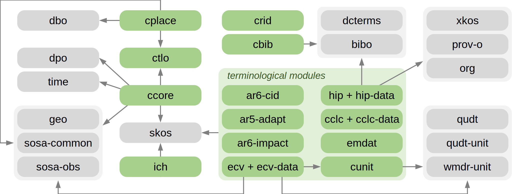

## CRIMA: The Ontology for Evidence-based Management of Climate Risks

## Overview

**CRIMA** is a modular domain ontology that formalises key concepts related to *climate risk*.
It enables the interlinking of:

1. qualitative domain knowledge captured through [*Impact Chains*](https://link.springer.com/chapter/10.1007/978-3-030-86211-4_25),
2. historical and simulated (quantitative) data, such as exposed assets and climatic events, and
3. established terminologies for risk-related concepts, some of which are provided as modules within CRIMA itself.

CRIMA serves as the semantic backbone for Knowledge Graph systems in the climate risk domain, facilitating the integration of heterogeneous data sources and supporting more informed climate change adaptation and risk management decisions.

## Scope and Design Principles

The CRIMA ontology focuses on semantic interoperability for climate risk assessment and adaptation workflows.

The ontology:
- is formalised in **OWL 2 DL**, with supplementary **SWRL** rules documenting additional intended semantics
- supports the integration of heterogeneous datasets with conceptual risk models
- provides a modular semantic framework for representing climate risk knowledge
- reuses established Semantic Web standards and domain vocabularies whenever possible, including SKOS, OWL-Time, GeoSPARQL, SOSA/SSN, QUDT, DCTERMS, and BIBO
- avoids commitment to a single upper ontology

The ontology is not intended to:
- provide operational support for disaster emergency response
- prescribe specific risk assessment methodologies
- act as a data repository or data management platform

## Quick Start

The current development version is available on the default repository [`master` branch](https://github.com/crima-ontology/ontology/tree/master).

Released versions are available as [tags](https://github.com/crima-ontology/ontology/tags) and can be downloaded from [GitHub Releases](https://github.com/crima-ontology/ontology/releases/).

To browse or edit the ontology in [Protégé](https://protege.stanford.edu/), open the main ontology file `crima.ttl`.

This file imports all the ontology modules located in the `/modules` directory.

Auxiliary resources used for development and validation (e.g., SHACL shapes) are located in the `/testing` directory.

Snapshots of imported third-party vocabularies are cached under `/imports` for reproducibility, both in their complete (`full`) versions and as the `fragments` imported and actually used by the ontology modules.

## Ontology Structure

CRIMA follows a modular architecture organised into thematic ontology modules.

The following diagram illustrates CRIMA modules (in green) along with reused third-party vocabularies (in gray) and the overall import structure.

The following CRIMA ontology modules are included:

| Category | Module(s) | Description |
|---|---|---|
| **Core** | [`ccore`](modules/ccore.ttl) | Core module providing a minimal, literature-grounded theory of climate risk to represent and link risk-related entities (e.g., hazards, impacts, exposures) in data and conceptual models |
|  | [`ctlo`](modules/ctlo.ttl) | Top-level ontology notions (e.g., event, process, quality) without commitment to a specific upper ontology |
| **Conceptual models** | [`ich`](modules/ich.ttl) | Ontological representation of *Impact Chains* [🔗](https://link.springer.com/chapter/10.1007/978-3-030-86211-4_25) |
| **Terminology** | [`ecv`](modules/ecv.ttl) + [`ecv-data`](modules/ecv-data.ttl) | *Essential Climate Variables* list with associated descriptions and units [🔗](https://oceanrep.geomar.de/id/eprint/57694/1/GCOS-245_2022_GCOS_ECVs_Requirements.pdf) |
|  | [`hip`](modules/hip.ttl) + [`hip-data`](modules/hip-data.ttl) | Hazard classification from the 2025 edition of the *Hazard Information Profiles (HIP)* [🔗](https://www.undrr.org/publication/documents-and-publications/hazard-information-profiles-hips-2025-version) |
|  | [`ar6-impact`](modules/ar6-impact.ttl) | Classification of *Observed Impacts from Climate Change* [🔗](https://www.ipcc.ch/report/ar6/wg2/) |
|  | [`emdat`](modules/emdat.ttl) | EM-DAT disaster classification [🔗](https://council.science/wp-content/uploads/2019/12/Peril-Classification-and-Hazard-Glossary-1.pdf) |
|  | [`ar5-adapt`](modules/ar5-adapt.ttl) | IPCC AR5 Adaptation scheme [🔗](https://www.ipcc.ch/site/assets/uploads/2018/02/SYR_AR5_FINAL_full.pdf#page=43) |
|  | [`ar6-cid`](modules/ar6-cid.ttl) | *Climatic Impact Drivers (CID)* types and categories [🔗](https://www.cambridge.org/core/books/climate-change-2021-the-physical-science-basis/415F29233B8BD19FB55F65E3DC67272B) |
|  | [`cunit`](modules/cunit.ttl) | Additional units complementing QUDT [🔗](https://qudt.org/) |
|  | [`cclc`](modules/cclc.ttl) + [`cclc-data`](modules/cclc-data.ttl) | CORINE land cover nomenclature [🔗](https://land.copernicus.eu/en/technical-library/clc-illustrated-nomenclature-guidelines/@@download/file) |
| **Other** | [`cbib`](modules/cbib.ttl) | Bibliography-related concepts aligned to BIBO [🔗](https://dcmi.github.io/bibo/) and DCTERMS [🔗](https://www.dublincore.org/specifications/dublin-core/dcmi-terms/) |
|  | [`cplace`](modules/cplace.ttl) | Geospatial entity classes aligned to GeoSPARQL [🔗](https://www.ogc.org/standards/geosparql/), SOSA [🔗](https://www.w3.org/TR/vocab-ssn/) and DBpedia ontology [🔗](https://www.dbpedia.org/resources/ontology/)|
|  | [`crid`](modules/crid.ttl) | Concepts and properties for established identification systems (e.g., ZIP codes) |

## License

The CRIMA ontology is licensed under [CC BY-SA 4.0](https://creativecommons.org/licenses/by-sa/4.0/).
See the [`LICENSE`](LICENSE) file for details.

## Acknowledgements

This ontology has been developed within the *CRIMA project* (Evidence-based Management of Climate Risks), funded by the *European Regional Development Fund (FESR)*.

CRIMA aims to support evidence-based climate risk assessment by integrating Earth Observation data, scientific knowledge, and semantic technologies.

Project website: [crima.eurac.edu](https://crima.eurac.edu/)

