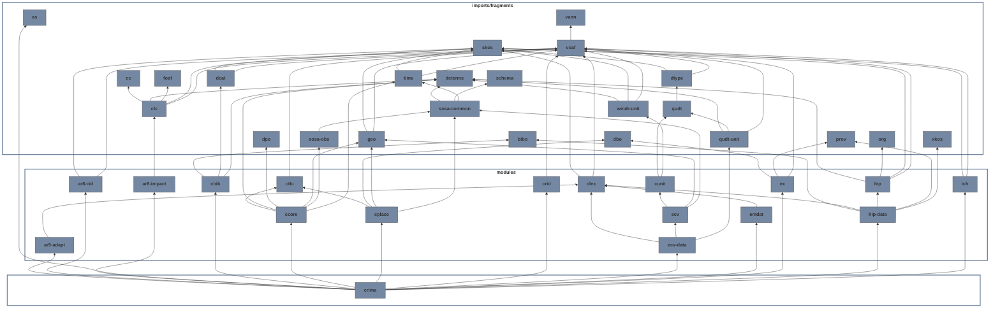

# CRIMA Ontology

## Module Structure

(Note: copy & paste diagram code in https://mermaid.live/ for a better experience)

```mermaid
flowchart BT
    classDef invisible fill:transparent,stroke:transparent;
    classDef subvoc fill:#7588a3,stroke:#555555,stroke-width:1px;
    classDef voc fill:#7588a3,stroke:#555555,stroke-width:2px;
    style sg_imports_fragments fill:transparent,stroke:#7588a3,stroke-width:3px;
    style sg_main fill:transparent,stroke:#7588a3,stroke-width:3px;
    style sg_modules fill:transparent,stroke:#7588a3,stroke-width:3px;

    subgraph sg_imports_fragments["<b>imports/fragments</b>"]
        as["<b>as</b>"]:::subvoc
        bibo["<b>bibo</b>"]:::subvoc
        cc["<b>cc</b>"]:::subvoc
        clc["<b>clc</b>"]:::subvoc
        dbo["<b>dbo</b>"]:::subvoc
        dcat["<b>dcat</b>"]:::subvoc
        dcterms["<b>dcterms</b>"]:::subvoc
        dpo["<b>dpo</b>"]:::subvoc
        dtype["<b>dtype</b>"]:::subvoc
        foaf["<b>foaf</b>"]:::subvoc
        geo["<b>geo</b>"]:::subvoc
        org["<b>org</b>"]:::subvoc
        prov["<b>prov</b>"]:::subvoc
        qudt["<b>qudt</b>"]:::subvoc
        qudt_unit["<b>qudt-unit</b>"]:::subvoc
        schema["<b>schema</b>"]:::subvoc
        skos["<b>skos</b>"]:::subvoc
        sosa_common["<b>sosa-common</b>"]:::subvoc
        sosa_obs["<b>sosa-obs</b>"]:::subvoc
        time["<b>time</b>"]:::subvoc
        vann["<b>vann</b>"]:::subvoc
        voaf["<b>voaf</b>"]:::subvoc
        wmdr_unit["<b>wmdr-unit</b>"]:::subvoc
        xkos["<b>xkos</b>"]:::subvoc
    end

    subgraph sg_main["<b> </b>"]
        crima["<b>crima</b>"]:::subvoc
    end

    subgraph sg_modules["<b>modules</b>"]
        ar__adapt["<b>ar5-adapt</b>"]:::subvoc
        ar__cid["<b>ar6-cid</b>"]:::subvoc
        ar__impact["<b>ar6-impact</b>"]:::subvoc
        cbib["<b>cbib</b>"]:::subvoc
        ccore["<b>ccore</b>"]:::subvoc
        clex["<b>clex</b>"]:::subvoc
        cplace["<b>cplace</b>"]:::subvoc
        crid["<b>crid</b>"]:::subvoc
        ctlo["<b>ctlo</b>"]:::subvoc
        cunit["<b>cunit</b>"]:::subvoc
        ecv["<b>ecv</b>"]:::subvoc
        ecv_data["<b>ecv-data</b>"]:::subvoc
        emdat["<b>emdat</b>"]:::subvoc
        ex["<b>ex</b>"]:::subvoc
        hip["<b>hip</b>"]:::subvoc
        hip_data["<b>hip-data</b>"]:::subvoc
        ich["<b>ich</b>"]:::subvoc
    end

    sg_modules --------- sg_imports_fragments
    linkStyle 0 stroke-width:0px

    ar__adapt --> clex
    ar__cid --> skos
    ar__cid --> voaf
    ar__impact --> clc
    cbib --> bibo
    cbib --> dcat
    cbib --> dcterms
    ccore --> ctlo
    ccore --> dcterms
    ccore --> dpo
    ccore --> geo
    ccore --> sosa_obs
    ccore --> time
    clc --> cc
    clc --> dcterms
    clc --> foaf
    clc --> skos
    clc --> voaf
    clex --> skos
    clex --> voaf
    cplace --> ctlo
    cplace --> dbo
    cplace --> geo
    cplace --> sosa_common
    crid --> voaf
    crima --> ar__adapt
    crima --> ar__cid
    crima --> ar__impact
    crima --> as
    crima --> cbib
    crima --> ccore
    crima --> cplace
    crima --> crid
    crima --> ecv_data
    crima --> emdat
    crima --> ex
    crima --> hip_data
    crima --> ich
    ctlo --> voaf
    cunit --> qudt
    cunit --> wmdr_unit
    dcat --> skos
    dcat --> voaf
    dtype --> skos
    dtype --> voaf
    ecv --> cunit
    ecv --> geo
    ecv --> sosa_common
    ecv_data --> clex
    ecv_data --> ecv
    ecv_data --> qudt_unit
    emdat --> clex
    ex --> dbo
    ex --> prov
    ex --> voaf
    geo --> skos
    geo --> voaf
    hip --> dcterms
    hip --> org
    hip --> skos
    hip --> voaf
    hip_data --> bibo
    hip_data --> clex
    hip_data --> hip
    hip_data --> prov
    hip_data --> xkos
    ich --> skos
    ich --> voaf
    qudt --> dtype
    qudt_unit --> dcterms
    qudt_unit --> qudt
    qudt_unit --> voaf
    sosa_common --> dcterms
    sosa_common --> schema
    sosa_common --> time
    sosa_obs --> sosa_common
    time --> skos
    time --> voaf
    voaf --> vann
    wmdr_unit --> dcterms
    wmdr_unit --> skos
    wmdr_unit --> voaf

    click ar__adapt href "http://www.semanticweb.org/crima/ipcc-ar5-adaptation#"
    click ar__cid href "http://www.semanticweb.org/crima/ipcc-ar6-cid#"
    click ar__impact href "http://www.semanticweb.org/crima/ipcc-ar6-impacts#"
    click as href "https://www.w3.org/ns/activitystreams#"
    click bibo href "http://purl.org/ontology/bibo/"
    click cbib href "http://www.semanticweb.org/crima/crima-bib#"
    click cc href "http://creativecommons.org/ns#"
    click ccore href "http://www.semanticweb.org/crima/crima-core#"
    click clc href "http://www.w3.org/2015/03/corine#"
    click clex href "http://www.semanticweb.org/crima/crima-lexicon#"
    click cplace href "http://www.semanticweb.org/crima/crima-place#"
    click crid href "http://www.semanticweb.org/crima/crima-id#"
    click crima href "http://www.semanticweb.org/crima"
    click ctlo href "http://www.semanticweb.org/crima/crima-tlo#"
    click cunit href "http://www.semanticweb.org/crima/crima-unit#"
    click dbo href "http://dbpedia.org/ontology/"
    click dcat href "http://www.w3.org/ns/dcat"
    click dcterms href "http://purl.org/dc/terms/"
    click dpo href "http://knowwheregraph/ontology/dpo"
    click dtype href "http://www.linkedmodel.org/schema/dtype"
    click ecv href "http://www.semanticweb.org/crima/crima-ecv#"
    click ecv_data href "http://www.semanticweb.org/crima/crima-ecv-data#"
    click emdat href "http://www.semanticweb.org/crima/emdat#"
    click ex href "http://example.org/ontology/"
    click foaf href "http://xmlns.com/foaf/0.1/"
    click geo href "http://www.opengis.net/ont/geosparql"
    click hip href "https://undrr-hip.org/hip-schema/"
    click hip_data href "https://undrr-hip.org/hip-data/"
    click ich href "http://www.semanticweb.org/crima/crima-impactchain#"
    click org href "http://www.w3.org/ns/org#"
    click prov href "http://www.w3.org/ns/prov-o#"
    click qudt href "http://qudt.org/schema/qudt"
    click qudt_unit href "http://qudt.org/vocab/unit"
    click schema href "http://schema.org/"
    click skos href "http://www.w3.org/2004/02/skos/core"
    click sosa_common href "http://www.w3.org/ns/sosa/common/"
    click sosa_obs href "http://www.w3.org/ns/sosa/obs/"
    click time href "http://www.w3.org/2006/time"
    click vann href "http://purl.org/vocab/vann/"
    click voaf href "http://purl.org/vocommons/voaf"
    click wmdr_unit href "http://codes.wmo.int/wmdr/unit/"
    click xkos href "http://rdf-vocabulary.ddialliance.org/xkos"
```
